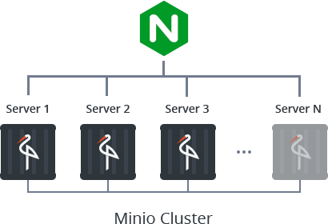
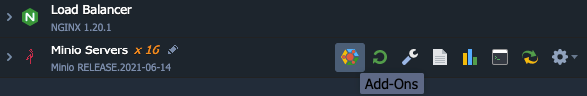
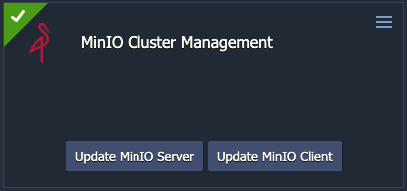

# MinIO Cluster

The **MinIO Cluster** solution by Layershift automates creation of a scalable and cost-efficient object storage cluster, which is fully compatible with Amazon S3 (_Simple Storage Service_). The package utilises [MinIO](https://www.minio.io/) microstorage architecture to interconnect a number of separate Docker containers distributed across separate physical hardware to create a reliable cluster, load balanced behind an Nginx proxy node.

MinIO divides objects into chunks and evenly distributes them among containers in an Erasure Set, protecting against silent data corruption (bitrot). By [adjusting the Storage Class](https://docs.min.io/minio/baremetal/concepts/erasure-coding.html#storage-classes), you can balance the level of redundancy against storage efficiency.

It can be accessed via S3 compatible APIs and the [MinFS fuse driver](https://github.com/minio/minfs).

## MinIO Cluster Installation

Or, log into your Layershift Jelastic account and [import](https://docs.jelastic.com/environment-import) the [manifest.jps](manifest.jps).

## Maintenance

MinIO and MinIO Client can be updated from the Jelastic dashboard.

**IMPORTANT**
* Please consult the [MinIO Release Notes](https://github.com/minio/minio/releases) to be aware of any breaking changes
* The update affects all MinIO servers at the same time, so please plan for a period of downtime.